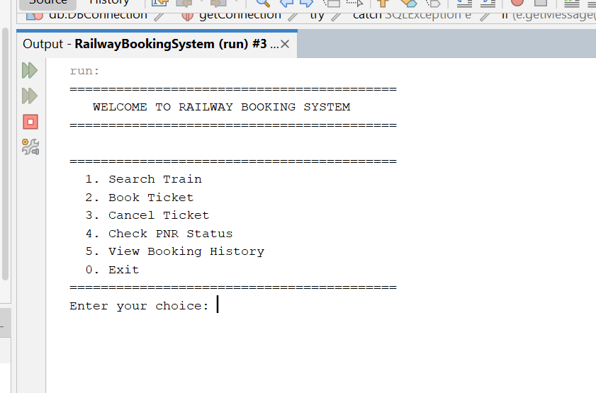
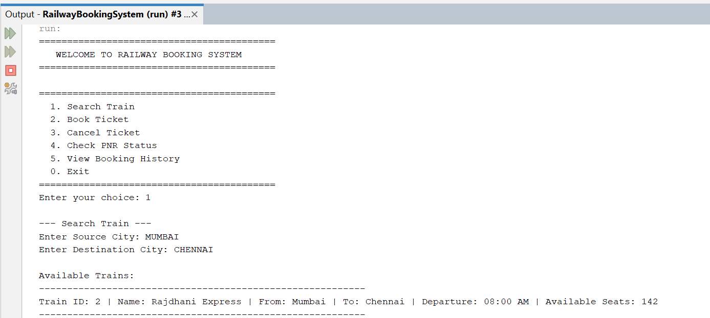
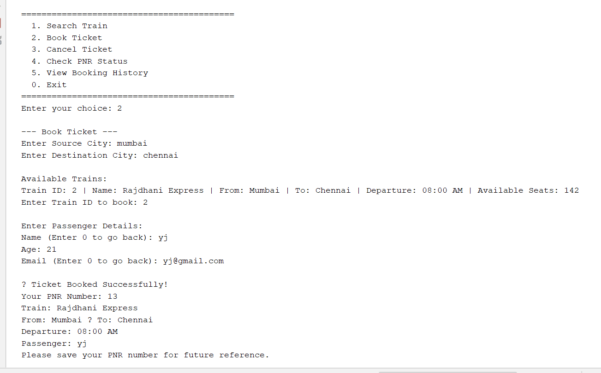
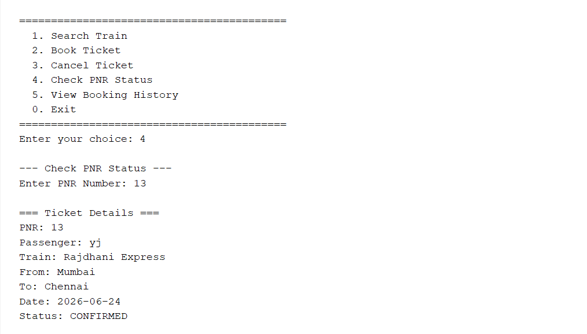
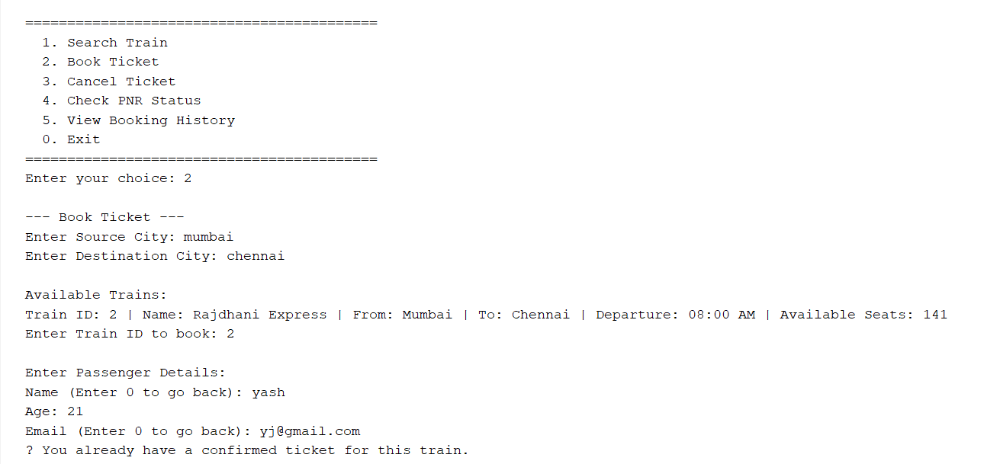

# Railway Booking System

A console-based Railway Booking System developed using Java, JDBC, and MySQL. The application allows users to search trains, book tickets, cancel bookings, check PNR status, and view booking history.

## Technologies Used

* Java
* JDBC
* MySQL
* SQL
* Object-Oriented Programming (OOP)
* DAO Design Pattern
* PreparedStatement
* Exception Handling
* Apache NetBeans

---

## Features

### Train Search

* Search trains using source and destination.
* Display available trains and seat availability.

### Ticket Booking

* Book tickets using passenger details.
* Auto-generate PNR numbers.
* Manage seat availability automatically.

### Ticket Cancellation

* Cancel tickets using PNR number.
* Restore seat availability after cancellation.

### PNR Status Check

* View booking details using PNR number.

### Booking History

* View all bookings associated with a passenger email.

### Input Validation

* Gmail validation.
* Name validation.
* Age validation.

### Duplicate Booking Prevention

* Prevents multiple confirmed bookings for the same train using the same email.

### Exception Handling

* Handles invalid inputs and database errors gracefully.

---

## Database Design

### Trains Table

* train_id
* train_name
* source
* destination
* departure_time
* total_seats
* available_seats

### Passengers Table

* passenger_id
* name
* age
* email

### Bookings Table

* pnr
* passenger_id
* train_id
* booking_date
* status

---

## Skills Demonstrated

* Java Programming
* JDBC Connectivity
* MySQL Database Management
* SQL Queries and Joins
* DAO Design Pattern
* Object-Oriented Programming
* PreparedStatement Usage
* Exception Handling
* Input Validation
* Database Relationships
* Foreign Key Constraints
* CRUD Operations
* Business Logic Implementation

---

## Project Structure

```text
RailwayBookingSystem
│
├── src
│   ├── dao
│   │   ├── TicketDAO.java
│   │   └── TrainDAO.java
│   │
│   ├── db
│   │   └── DBConnection.java
│   │
│   ├── main
│   │   └── Main.java
│   │
│   └── models
│       ├── Passenger.java
│       ├── Ticket.java
│       └── Train.java
│
├── screenshots
│   ├── main-menu.png
│   ├── train-search.png
│   ├── ticket-booking.png
│   ├── pnr-status.png
│   ├── duplicate-booking.png
│   └── database-schema.png
│
├── nbproject
├── build.xml
├── manifest.mf
└── README.md
```

---

## Screenshots

### Main Menu



### Train Search



### Ticket Booking



### PNR Status Check



### Duplicate Booking Prevention



### Database Schema


---

## Future Improvements

* JDBC Transactions (Commit/Rollback)
* Waitlist Management
* GUI Version using JavaFX
* Spring Boot REST API
* User Authentication and Authorization

---

## Author

**Yash Jain**
